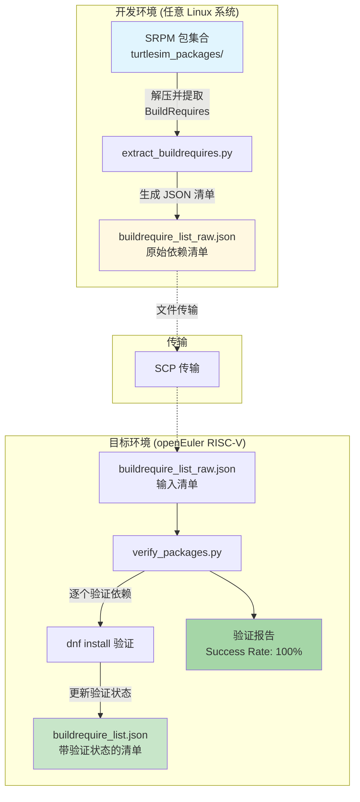

# README

## 快速开始示例
```
# Step 1: Scan deps
python3 extract_buildrequires.py --input ./srpms/

# Step 2: Analyze deps
python3 verify_packages.py --input buildrequire_list_raw.json
```
## 概述
在本文中你可以知道：
- 这个方案是什么
- 为什么需要这个方案
- 这个方案中的 `.json` 清单是怎么设计出来的
- 怎么使用这个方案（两个脚本分别怎么使用与协同）

如果你需要知道：
- 这个方案整体是如何设计出来的
- 更详细的背景与动机

请点击[这里](https://github.com/Sebastianhayashi/ROS-Porting/blob/main/Verification_Scheme_for_System-Level_Dependency.md)。
## 背景与动机（Why）
> 脚本核心价值在于在非 ROS 官方支持（即不支持 rosdep）的发行版上验证 ROS 包依赖的工具。

该脚本在做的事情与 `rosdep check --from-paths src --ignore-src -r` 一致，那么就会有一个问题：为什么要做一样的事？
对于像是要在 openEuler 等 ROS 官方支持的发行版上移植 ROS 相关软件包就无法使用官方工具链（如 rosdep、bloom 等）。无非两个做法：
1. 移植官方工具链
2. 自研工具

但是无论在开始移植官方工具链也好、自研工具也好，得先确定系统上的软件包足以支持移植 ROS 软件包，或者说至少先知道能够移植到什么程度（变体）。
于是在这样的背景下有了该脚本。
脚本可以的思路可以被借鉴复用，用一种简单的方式来搜集、管理并且验证相关的 ROS 系统级依赖的完备性。

本脚本的贡献主要是在于提供一个思路，由于本脚本高度的针对特殊需求进行优化，所以不一定能够适应大部分的场景。更多相关的思路请参考[这里](https://github.com/Sebastianhayashi/ROS-Porting/blob/main/Verification_Scheme_for_System-Level_Dependency.md)。

本文中叙述的脚本主要功能：
-  extract_buildrequires.py -> 生成依赖清单
- verify_packages.py -> 使用清单验证完备性
## 解决方案（What）
说明：scp 进行文件传输是因为演示过程为了更加清晰（同时文件更加清楚的管理）而使用了两个机器分别演示两个脚本各自的功能，实际使用的过程中完全可以在同一个环境中一起使用。



## 使用方式（How）
### extract_buildrequires.py
> 该脚本主要是用于从 srpm 中提取构建依赖（Buildrequire）条目，并且生成一份 .json 清单

1. usage：
```
## default out .json as buildrequire_list_raw.json
python3 extract_buildrequires.py --input /path/to/srpms/ 
```
2. 参数说明：
- --input：输入 srpm 文件夹地址
- --output：输出 `.json` 文件的名字，默认输出在脚本同一层文件夹下
```
--output <.json>
```

3. 输出格式：
```
{
  "require_pkg": "cmake",
  "system_pkg": "unknown",
  "install_verify": "n",
  "search_require": "n", 
  "miss": "unknown",
  "required_by": ["package1", "package2"]
}
```
4. 核心功能：
- 包名提取：从SRPM文件名中提取实际的包名`ros-humble-turtlesim-1.4.2-1.oe2403.src.rpm` → `turtlesim`
- SRPM解压：使用 `rpm2cpio` 和 `cpio` 工具解压SRPM文件
- 依赖解析：
    - 从 spec 文件中提取BuildRequires行
    - 处理多行依赖声明（以`\`结尾的行）
        - 解析各种格式的依赖：
            - 普通包名
            - `pkgconfig(package)` 格式
            - 带版本约束的依赖（>=、<=等）
- 依赖过滤：过滤掉所有以`ros-`开头的 ROS 依赖，仅保留系统级依赖
### verify_packages.py  
> 该脚本通过 `.json` 文件在 openEuler 上使用 `sudo dnf install <pkg>` 来验证系统包的可用性。

1. usage：

```
# dnf search <pkg> automaticlly
python3 verify_packages.py -v

# Specify input
python3 verify_packages.py --input buildrequire_list_raw.json

# skpi dnf update
python3 verify_packages.py --skip-update
```

2. 参数说明：
- --input：指定输入 `.json` 文件
- -v：查看详细日志
- --skip-update：跳过 dnf 更新（不加参数情况下默认更新）
3. 输出格式：
```
  {
    "require_pkg": "cmake",
    "system_pkg": "cmake",
    "install_verify": "y",
    "search_require": "n",
    "miss": "n",
    "required_by": [
      "ament",
      "cyclonedds",
      "fastcdr",
      "fastrtps",
      "foonathan",
      "gmock",
      "google",
      "gtest",
      "iceoryx",
      "osrf"
    ],
```

4. 核心功能：
- **包安装验证**    
    - 使用 `sudo dnf install` 测试每个包        
    - 检测三种状态：        
        - 成功安装            
        - 已经安装          
        - 安装失败
            
- **增量更新**    
    - 每验证一个包就保存一次结果        
    - 防止中断导致数据丢失        
    - 更新字段：        
        - `install_verify`: 设为"y"表示已验证            
        - `miss`: "n"表示可用，"unknown"表示不可用            
        - `system_pkg`: 成功时设为包名            
        - `last_check`: 记录检查时间  

- **输出文件命名**    
    - 自动去除输入文件名中的"raw"        
    - 例如：`buildrequire_list_raw.json` → `buildrequire_list.json`   

- **统计报告**   
    - 显示验证进度       
    - 汇总成功/失败统计       
    - 列出失败的包


统计报告示例：
```
[PROGRESS] VERIFICATION SUMMARY
[PROGRESS] ============================================================
[PROGRESS] Total packages verified: 24
[PROGRESS] Successfully installed: 0
[PROGRESS] Already installed: 24
[PROGRESS] Failed to install: 0
[PROGRESS] Success rate: 100.0%
[PROGRESS]
Results saved to: /home/Melon/verify_json/buildrequire_list.json
```
## .json 结构说明（design）
首先脚本会直接从 spec 文件中搜集来许多的依赖条目，那么第一个条目就这么确定了：`require_pkg`（原始需求）。
有了原始需求之后需要让系统上的包管理器（也就是 dnf）尝试一下 install，于是就有了条目`install_verify`（是否尝试）。如果默认是 n（也就是 no，没有），如果尝试了就写 y（也就是 yes）。
可是尝试了之后会有三种结果：
- 成功安装
- 已经安装
- 无法安装
	- 找不到包
	- 因为其他原因
    
如果是前两种情况的话，大可以直接记录没有确保，于是需要另一个条目记录是否缺包，那么就：`miss` 吧。前两种情况写：n，如果是无法安装就写 unknown，因为可能的问题是：
1. 真的没有这个包 -> 即缺包
2. 命名问题 -> 有这个包，但是名字不一样

如果是这种情况的话怎么办呢？
那么就需要人工验证了，如果是缺包人工修改 `.json` 就行了。如果是包名问题怎么办呢？也就是说有这个包但是包名不一样的情况，那么就需要另一个条目记录这个差异，于是就有了：`system_pkg`（系统映射）。其实一般情况下 `system_pkg` 与 `require_pkg` 是一致的。
哦对了忘说了，还需要一个条目来记录是否需要人工介入，人工介入一般也就只能去查找（search），那么就叫：`search_require` 吧，查找完了之后就再手动改 `miss`  跟 `system_pkg` 条目。

### 设计原则
在设计这个 `.json` 结构的时候考虑到了说不能把所有的事情都交给脚本做，所以这个工作流其实是一个半自动化的方案，也就是人机协作，人工会介入判断。
同时这个清单做的事情就是记录每个包的状态，同时能够记录包名的差异（允许特殊情况存在）。
最后可以拿着这份清单来进行依赖分析，缺失多少的依赖，存在多少问题，我们能够构建到什么 ROS 变体。

### 场景对比

| 场景   | require_pkg    | system_pkg | install_verify | search_require | miss    | 说明        |
| ---- | -------------- | ---------- | -------------- | -------------- | ------- | --------- |
| 正常安装 | cmake          | cmake      | y              | n              | n       | 包名一致，直接成功 |
| 包名不同 | opencv-devel   | opencv     | y              | y              | n       | 需要人工确认映射  |
| 确认缺包 | gazebo11-devel | unknown    | y              | y              | y       | 系统中没有此包   |
| 初始状态 | boost-devel    | unknown    | n              | n              | unknown | 未验证状态     |

### 详细示例

**场景: 正常安装成功**
```json
{
  "require_pkg": "cmake",
  "system_pkg": "cmake",
  "install_verify": "y",
  "search_require": "n",
  "miss": "n",
  "required_by": ["pkg1", "pkg2"]
}