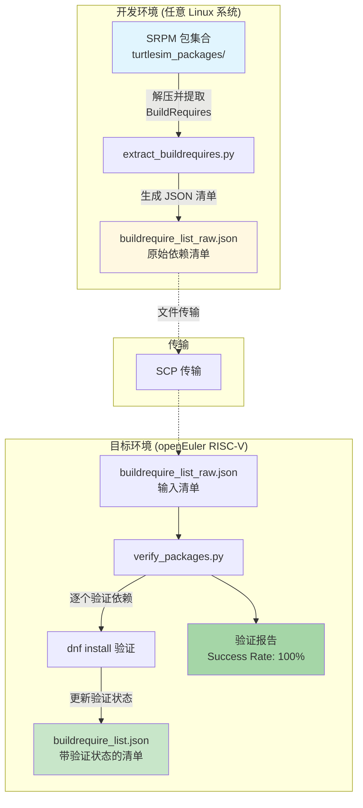

# 验证 ROS 系统级依赖完备性方案
## 1. 为什么需要新的工作流（必要性）
**中心论点：现有条件下无法有效进行ROS包依赖验证**
### 1.1 依赖验证的重要性

目前 Risc-V 生态相比 x86 以及 aarch64 架构而言显得过于年轻，许多的生态建设不是很成熟，对于我们目前的工作而言的挑战是我们不知道目前 ROS Humble 所要求的系统级依赖是否都能够满足。且除开依赖外的因素，可能还存在潜在的其他问题，所以我们更需要首先排除依赖这第一要素问题。
若不对依赖进行预先验证，可能会出现必要依赖缺失/不正确的情况，导致构建到一半的工程直接宣布失败。
### 1.2 openEuler 特有软件包命名差异或者缺少

软件包命名可能存在差异或者缺失，如软件包 `opencv`，我们能够从下面的日志中看出 `dnf` 只能搜索到 `opencv.riscv`，这会产生两个问题是 `opencv.riscv`这个软件包是否包含 `opencv-devel`：
- 如果包含 -> spec 中需要把 `opencv-devel` 都写成 `opencv`
- 如果不包含，则说明缺包

详细日志说明：
```
[Melon@openeuler-riscv64 humble_oe]$ sudo dnf update
[sudo] password for Melon:
Last metadata expiration check: 1:42:56 ago on Wed 16 Jul 2025 12:18:28.
Dependencies resolved.
Nothing to do.
Complete!
[Melon@openeuler-riscv64 humble_oe]$ dnf search opencv
Last metadata expiration check: 1 day, 0:02:22 ago on Tue 15 Jul 2025 13:59:12.
======================== Name & Summary Matched: opencv ========================
opencv.riscv64 : OpenCV means Intel® Open Source Computer Vision Library.
[Melon@openeuler-riscv64 humble_oe]$
```

先前也有同事反馈 `.spec` 文件中的依赖名称与系统上的软件包依赖名称不相同的问题，而这个问题会直接导致构建的失败，所以对 ROS 包依赖的验证是十分必要的。

### 1.3 openEuler ROS Humble spec 文件高度自定义
openEuler 社区官方发布的相关 .spec 文件与官方 .spec 文件存在大量的差异，具体体现在写法、以及依赖包名上等。那么在这样的背景下， 几乎无法考虑现成的方案，只能够自己设计一个简单、适用于 openEuler 的工作流。

### 1.4 现有工具的局限性

为了进行 ROS 包依赖的验证，曾考虑过使用现成成熟的方案如：`rosdep`。该工具可以直接使用系统上的包管理器检测相关构建的依赖完备性。
为什么放弃该方案？openEuler 上的 rosdep 并不是官方维护而是移植，而移植的清单中的软件包处于长期（至少一年）无人维护。如果强行使用 `rosdep` 则需要去验证上游移植的 `rosdistro` 中的软件清单的正确性，那反而会把问题扩大化，加大任务复杂度。

**章节结论：需要建立新的自动化验证工作流**

## 2. 如何解决（方案设计 + 技术实现）
###  2.1 方案设计 

**核心设计理念**：spec 提取依赖 -> 生成依赖清单 -> 系统验证
**核心论点**：上述工作流可以有效的检验 ROS 依赖的完备性

#### 2.1.1 为什么这么设计？
- 依赖提取方案选择

.spec 文件中的 `Buildrequire` 是最权威的依赖需求，在设计工作流的时候就已经确定了不能够脱离 .spec 文件使用其他的方式来确定我们需要多少系统级依赖，于是直接从 .spec 文件中进行文件提取是最稳妥的方式。
- 清单格式设计考虑

但是提取出来的依赖我们需要一个集中式的管理方式，既然需要管理、又需要作为脚本输入物，所以生成的清单选择 .json 作为格式文件，不仅能够有秩序的记录依赖问题，同时也可以更为方便的作为脚本输入物，更具有拓展性，未来可以考虑将 .json 清单做成一个可以持续维护的依赖清单文件，方便更多的开发者知晓目前的依赖情况。比如说，我们可以做一个包支持矩阵，可以并入 RuyiSDK 等。
- 验证方法的确定

在我们已经拿到了一份需要确定的依赖清单后，该考虑的部分就是如何验证。最初的设想将上游所有的包都拉下来到本地再做成一份上游系统级依赖清单，然后两份清单进行对比，可是这样会存在问题就是如何进行精确的配对，因为 ROS 所需要的系统级依赖数量远远小于系统级依赖，要写规则进行配对反而麻烦。
那么上述的思路走不通，dnf 包管理器作为 openEuler 上的包管理器，如果要实时的验证依赖的存在是最具有说服力的。

使用 dnf 要如何进行验证，最初考虑的是 dnf search，但是这么做的话会匹配到类似的包，不能够真正定位到我们想要的包。

于是到最后决定选择使用 dnf install，如果能够找到对应的包，就在清单上把 `miss` 的条目写上 n，表示保存在，如果发现无法 install 那就说明缺包或者包名不匹配，这时候再进行人工排查就行了。

### 2.1.2 技术实现
确定了设计方案后，我们选择了以下技术栈来实现：

工作流中的脚本介使用 Python 编写，使用 Python 语言而不是 shell 的主要原因是因为需要处理复杂的 .json，且考虑到未来可能可以集成到自研工具中，作为一个全新的工具。
关于软件包的验证采用了 dnf 直接进行 install 可以最大程度的保证验证依赖的正确性。

工作流包含两个核心脚本：

1) extract_buildrequires.py
   功能：从 srpm 包中提取所有 BuildRequire 依赖
   实现：
   - 使用 rpm2cpio 解包 srpm
   - 正则匹配提取 BuildRequire
   - 去重并生成 JSON
   
2) verify_packages.py  
   功能：在目标系统上验证依赖可用性
   实现：
   - 读取 JSON 清单
   - 调用 dnf install 逐个验证
   - 更新验证状态

可行性证据（下面会演示）：
- 24个包100%验证成功
- 脚本稳定运行无错误
- 结果可重现

#### 2.1.3 工作流实例演示

为了验证 turtlesim 依赖在 openEuler 24.03 LTS RISC-V 的完备性，首先将所有 [openEuler 社区发布](https://repo.openeuler.org/openEuler-24.03-LTS/EPOL/multi_version/ROS/humble/source/)]的 ROS Humble srpm 下载到本地，通过特定的方式提取出所有与 turtlesim 相关的 srpm，也就是下文中的 `turtlesim_packages` 文件夹（即该文件夹中的 srpm 为 turtlesim 及其相关依赖的集合），再使用两台不同的机器演示两个流程以演示其有效性与对用户的友好程度。
> 说明：演示使用两台机器是为了更方便的让读者理解两个不同的工作流，实际操作完全可以在同一个硬件/环境下复现。

环境：
1. 在任意Linux环境提取依赖（演示用Fedora）机器 A
2. 具有 openEuler 24.03 LTS RISC-V 环境的机器 B
机器 A 中的工作文件夹结构如下：
```
almond@localhost:~/generate_json$ tree -L 1
.
├── buildrequire_list_raw.json -> generated .json
├── extract_buildrequires.py -> script for geenrate .json
└── turtlesim_packages ->  srpm packages

2 directories, 2 files
```
准备 srpm 或者 .spec 作为输出物，运行脚本，脚本能够根据 .spec 中的内容生成 buildrequire_list_raw.json
将机器 A 中生成的 buildrequire_list_raw.json scp 到机器 B 上，机器 B 中的工作文件夹为：
```
[Melon@openeuler-riscv64 verify_json]$ tree
.
├── buildrequire_list.json -> buildrequire with status
├── buildrequire_list_raw.json -> input .json
└── verify_packages.py -> script

1 directory, 3 files
```
准备 buildrequire_list_raw.json 作为输入文件， 运行脚本，生成 buildrequire_list.json
脚本运行结束总结当前总结的：
```
[PROGRESS] VERIFICATION SUMMARY
[PROGRESS] ============================================================
[PROGRESS] Total packages verified: 24
[PROGRESS] Successfully installed: 0
[PROGRESS] Already installed: 24
[PROGRESS] Failed to install: 0
[PROGRESS] Success rate: 100.0%
[PROGRESS]
Results saved to: /home/Melon/verify_json/buildrequire_list.json

```

图示：

